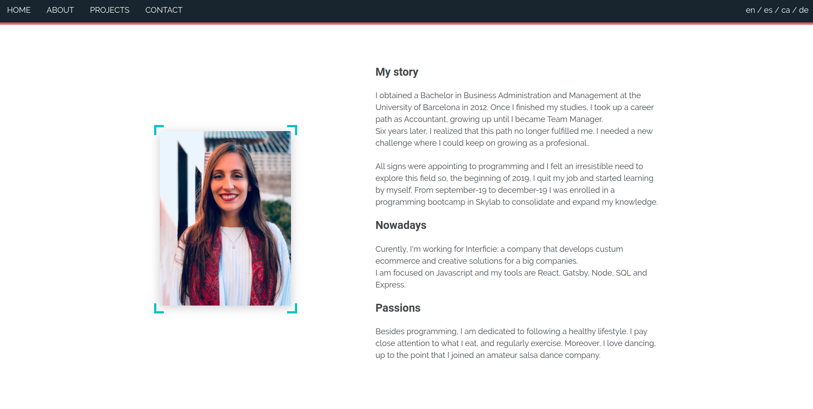
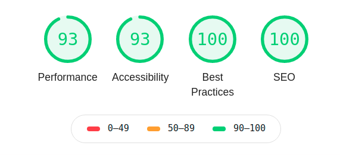
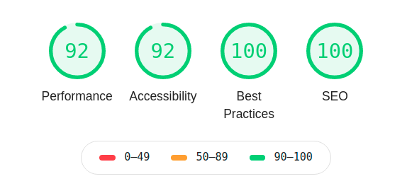

# Multilingual Portfolio



## Introduction

This is my Portfolio, in it you will find all my personal projects as well as details about them, links to demos, source code, my biography or my curriculum. The page has been translated into 4 languages, since it has been developed expressly to collaborate in my sister's Bachelor's Degree Final Project on technological translations.

You can run the deployed project here: https://dianamoreno.netlify.app

## Features

- This is a multi-language website: English, Spanish, Catalan and German.
- Translations provided by Yolanda Moreno.
- The design is based on a single page showing my biography, my projects and contact details.
- My curriculum can be downloaded in all four languages.
- Each of the projects shows information about what features it has, what I learned in developing it, links to the source code and a demo.
- You can contact me by filling out the form in the contact section or else by mail or social networks."

## What I learned?

- How to prepare a project to be translated into four languages.
- How to dynamically generate pages through a template.
- How to perform static and dynamic queries with GraphQL.
- How to select the active menu section when scrolling through the page using the Intersection Observer.
- How to add a back-end linked form to send emails.
- How to provide options for downloading files.
- Improve SEO, create a sitemap and index it in Google with Google Search Console.

## Technical Description

Frontend: Gatsby with React (javascript), CSS-SASS-modules

Backend: Node with Express

Others: Git, Github

## Usage

**Prerequisites:**

- Install Node.js if you haven't yet (https://nodejs.org/es/). Npm is needed but is included installing Node.js.

**Next steps:**

- Download or clone the following repository in your local https://github.com/diana-moreno/portfolio.git.

- Enter to the folder and install dependencies:

  ```shell
  cd portfolio
  npm i
  ```

**Running:**

- Open it in your localhost. Your site is now running at `http://localhost:8000`!

  ```shell
  npm start
  ```

**Optional:**

- If you want, you can check the backend in this repository but it's not necessary to run locally: https://github.com/diana-moreno/portfolio-api.git.

## Audits

Gatsby it's great! It allows me to achieve those punctuations in Audits analysis:

Desktop



Mobile


